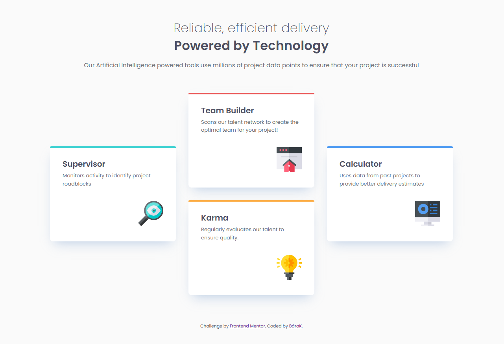

# Frontend Mentor - Four card feature section solution

This is a solution to the [Four card feature section challenge on Frontend Mentor](https://www.frontendmentor.io/challenges/four-card-feature-section-weK1eFYK). Frontend Mentor challenges help you improve your coding skills by building realistic projects. 

## Overview

### The challenge

Users should be able to:

- View the optimal layout for the site depending on their device's screen size

### Screenshot

### Links

- Solution URL: [https://github.com/BaraKalvo/FM_four_card_feature]
- Live Site URL: [https://barakalvo.github.io/FM_four_card_feature/]

## My process

### Built with

- Semantic HTML5 markup
- CSS custom properties
- Flexbox
- CSS Grid
- Mobile-first workflow

### What I learned

- How to create a page layout using CSS Grid and template-areas
- How to decorate an element using the ::before pseudo-element

## Author

- Frontend Mentor - [@BaraKalvo](https://www.frontendmentor.io/profile/BaraKalvo)

